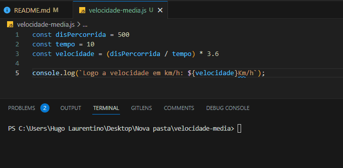

<h1 align="center">
  
</h1>

### Velocidade média

- [x] Bak-End
- [x] Criar Título
- [x] Criar Descrição
- [x] Sobre
- [x] Tecnologia
- [x] Pre requisito
- [x] Autor
- [x] GIF‘s
---
<h1 align='center'>Velocidade Média</h1>

<p align='center'>Esse é um exemplo de logica em javascript</p>

<p align='center'>
	<a href='#sobre'>Sobre</a> |
	<a href='#pré-requisitos'>Pre Requisitos</a> |
	<a href='#tecnologias'>Tecnologias</a> |
	<a href='#autor'>Autor</a>
</p>

---
<h1 align='center'>
	
</h1>

---
### Sobre
  <p align= 'justify'>
  Suponha que você está trabalhando no desenvolvimento de um 
  App, que calcula a velocidade média de uma pessoa que está usando o App em uma corrida.

  Calcule a velocidade média dessa pessoa a partir da distância percorrida pela pessoa e pelo tempo que passou, utilizando a fórmula abaixo.

$$ Velocidade = \frac{distPercorrida}{tempo} $$

  Contudo, as informações de distância que você recebe estão em metros e o tempo em segundos.
  
  Ou seja, ao aplicar esta fórmula, a velocidade estará em metros por segundo. O ideal é que o seu usuário veja a velocidade em km/h.

  Para isso, após fazer o calcula da velocidade, você deve transformar a unidade de metros por segundo para km/h. Para isso, basta multiplicar o resultado por 3,6.
  </p>


---
### Pré-requisitos 

Antes de começar, você vai precisar ter instalado em sua máquina as seguintes FERRAMENTAS: [GIT](https://git-scm.com/), [Node.js](https://nodejs.org/en/download). 
Além disto é bom ter um editor para trabalhar com o código como [VSCode](https://code.visualstudio.com/download).

### 🎲 Rodando o Back End

```bash
# Clone este repositório
$ git clonehttps://github.com/hugolaurentino/velocidade-media.git

# Acesse a pasta do projeto no terminal/cmd
$ cd velocidade-media

# Instale as dependências
$ npm install

# Execute 
$ node .\velocidade-media.js

```
### Tecnologias 

As seguintes ferramentas foram usadas na construção do projeto:

- [Node.js][nodejs]
---

## Autor

Feito com ❤️ por Hugo Laurentino 👋🏽 [Entre em contato!](https://www.linkedin.com/in/hugo-laurentino-silva/)

[nodejs]: https://nodejs.org/